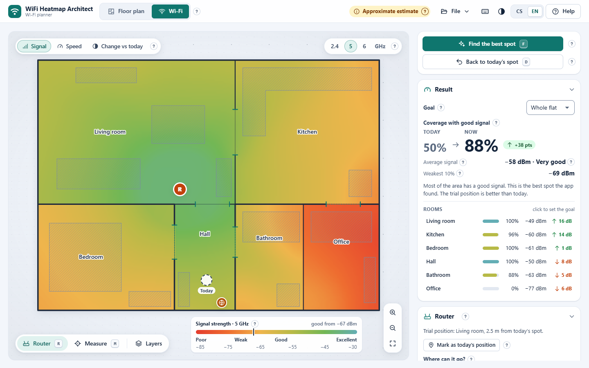

# WiFi Heatmap Architect

**Where is your Wi-Fi signal good, and where should the router go?** Draw your home (or start from the demo flat),
drag the router around and watch a live heat map of the signal. Built for ordinary people, not network engineers:
plain language, little "?" hints everywhere, Czech and English.

**Open the app: <https://zizlik.github.io/WiFi-Heatmap-Architect/>** (Czech version:
[index.cs.html](https://zizlik.github.io/WiFi-Heatmap-Architect/index.cs.html)). It works on a computer and on a phone,
can be installed to the home screen and keeps working offline.

[](https://github.com/Zizlik/WiFi-Heatmap-Architect/actions/workflows/ci.yml)
[](LICENSE)



<p>
  
  
</p>

## What it does

WiFi Heatmap Architect estimates Wi-Fi coverage from a floor plan. Every wall, door and larger piece of furniture takes
some signal away; the app turns that into a colour map of your home, a coverage percentage for the whole flat and for
every room, and a suggestion where the router would serve you best. A few measurements taken with your phone calibrate
the model to your real home.

It is a single self-contained HTML file: no account, no installation, no server. Calculations run in your browser.

## Features

- **Live heat map** of the signal for 2.4, 5 and 6 GHz, with plain-word quality (Excellent ... Unusable), coverage of
  the whole flat and per room, and a "change vs today" view that shows what moving the router would gain or lose.
  Walls and furniture weaken the bands differently (per-band material tables: brick 7 / 11 / 13 dB at 2.4 / 5 / 6 GHz),
  so 2.4 GHz reaches visibly further through walls and 6 GHz the least.
- **Find the best spot**: an optimiser scores router positions about half a metre apart all over the floor (or only in
  a room you choose), refines the best ones and moves the router there. One key (`D`) brings it back to where it stands today.
- **Floor-plan editor** with rectangle and polygon rooms, walls (with materials), doors, furniture presets, real-world
  scale, snapping, undo/redo, a tracing background (an image of your plan to draw over) and a **plan check** that finds
  gaps in walls, misplaced doors and overlapping rooms.
- **Measurements & calibration**: enter the signal you measured at a few spots (dBm, or % from Windows) and the model
  shifts to agree with them; it reports how well it fits.
- **Built-in speed test** (download, upload, ping, jitter) against Cloudflare's speed-test servers, started only when
  you tap it. With speeds measured in places with clearly different signal the app can also draw a predicted
  **speed map**.
- **Second access point / mesh**: wired AP, wired or wireless mesh node, or a repeater, with backhaul quality.
- **Works offline and installs like an app** (PWA) when opened from the web page; the downloaded HTML file also
  works by double-click, with no network at all.
- **Czech and English**, switchable at any time; light and dark mode; colour-blind friendly palette.
- **Keyboard first**: every action has a shortcut, every icon has a tooltip with its key, `?` shows them all.

### Keyboard shortcuts

| Where | Key | Action |
|---|---|---|
| Everywhere | `1` / `2` | Floor plan / Wi-Fi mode |
| | `?` / `F1` | Shortcut sheet / Help |
| | `Ctrl+S` / `Ctrl+O` | Save the project as SVG / open a file |
| | `Ctrl+Z` / `Ctrl+Shift+Z`, `Ctrl+Y` | Undo / redo |
| | `+` `-` `0` | Zoom in / out / show the whole plan |
| | `Esc` | Cancel, close |
| Wi-Fi mode | `R` / `M` | Router tool / measure tool |
| | `F` | Find the best spot |
| | `D` | Router back to today's spot |
| | `B` / `V` / `L` | Next band / next view (signal, speed, change) / range lines |
| | arrows (`Shift`) | Move the router by 0.25 m (1 m) |
| | `Enter` | Save a pending measurement |
| Floor plan | `V` `R` `P` `W` `D` `F` `S` | Select, rectangle room, polygon room, wall, door, furniture, scale |
| | `G` / `T` | Snap to grid / tracing background |
| | `Enter` | Finish a polygon room |
| | `Delete` / `Ctrl+D` | Delete / duplicate the selection |
| | arrows (`Shift`) | Nudge the selection (4x) |

Mouse and touch: drag empty space to pan, wheel or two fingers to zoom, double-click empty space to fit the plan.

## On a phone

Open <https://zizlik.github.io/WiFi-Heatmap-Architect/> and add it to the home screen (Android: browser menu >
*Add to Home screen* / *Install app*; iPhone: Safari > Share > *Add to Home Screen*). After the first visit it works
offline; only the speed test needs a connection. Walk through your home, tap the map where you stand and run the speed
test: after a few spots you see where the internet is fast and where it is not. When a new version is published the
app offers it with a *Reload* button.

To move a project between devices save it as SVG (File > Save project as SVG) and open that file on the other device.

## Privacy

Calculations run in your browser. Your floor plan, measurements and settings are stored only in your browser's local
storage (or in the SVG files you save yourself) and are never uploaded. The network is used only to load and update
the app (from GitHub Pages) and for the **speed test you start yourself**, which downloads and uploads test data
to and from `speed.cloudflare.com` (about 30-60 MB per run; mind mobile data). The app has no analytics and no cookies.

## Using your own floor plan

- **Draw it**: Floor plan mode (`1`) > rectangle (`R`) or polygon (`P`) rooms, then *Outline the rooms with walls*,
  add doors (`D`) and big furniture (`F`), and set the real width of the home or measure a known distance (`S`).
- **Trace an image**: drop a PNG, JPG or WebP (a photo of the plan, a real-estate drawing) onto the app; it becomes a
  tracing background and you draw the rooms over it.
- **Open a saved project**: an SVG saved from this app (File > Save project as SVG) contains the whole project and
  opens again with `Ctrl+O` or drag and drop. SVG files from other programs are used as a tracing background.

### File format compatibility

Projects are SVG drawings with the data in `<metadata id="wifi-plan-data">` using the `wifi-floor-v2` format of the
previous version of the app (rooms, walls, doors, furniture, background, width, router, original, optic). Version 3
reads those files unchanged and writes files that the old version can still open; its extra settings (scale, second
AP, measurements, view) are stored alongside under `project` and ignored by older versions.

## Development

No dependencies, no bundler. The sources in `src/` are plain browser scripts that `build.mjs` concatenates (in path
order) into two self-contained files, `index.cs.html` (Czech default) and `index.html` (English default); they are the
same app and switch language at runtime. The build also writes `sw.js` and `manifest.webmanifest` for the installable,
offline-capable web version (the service worker is only used over http/https, never for a double-clicked file).

```sh
node build.mjs            # build index.html, index.cs.html, sw.js, manifest.webmanifest
node build.mjs --check    # + checks: syntax, cs/en strings complete, hints, no external URLs, PWA files, size <= 1.5 MB
node tests/engine/run-all.mjs    # engine tests (node:test): geometry, propagation, calibration, optimiser, formats ...
npm test / npm run check / npm run build    # the same through npm
WH_PRIVATE_PLAN=/path/to/plan.svg node tests/engine/run-all.mjs   # + extra checks on a real plan of your own (never committed)
```

- `src/js/00-core` runtime (i18n, store with undo, viewport) - `10-engine` the DOM-free model (runs in Node for the
  tests) - `20-ui` shell, widgets, hints, icons, PWA - `30-io` import/export - `35-speedtest` the speed test -
  `40-editor` floor-plan mode - `50-planner` Wi-Fi mode - `90-app` glue. `src/SPEC.md` and `src/DESIGN.md` describe the
  product and the UI contract, `src/ENGINE-API.md` the engine.
- The generated files are committed because GitHub Pages serves the repository as it is; CI fails when they are not
  rebuilt. Serve the folder over http to try the PWA locally, e.g. `python -m http.server`.
- README screenshots: `npm install --no-save puppeteer-core && node docs/make-screenshots.mjs` (uses the demo flat).
- The PWA icons in `assets/` are the brand mark rendered to PNG (192, 512, maskable 512, apple-touch 180).

## Credits

- Signal model: log-distance path loss with per-wall and per-object losses, in the spirit of the indoor propagation
  model of [ITU-R P.1238](https://www.itu.int/rec/R-REC-P.1238/en). It is an estimate, not a measurement - calibrate it
  with a few real readings.
- Speed test: the measuring method (latency samples, growing download/upload sizes, 90th-percentile throughput) is
  modelled on Cloudflare's open-source [speedtest](https://github.com/cloudflare/speedtest) client (MIT) and uses
  the public endpoints of [speed.cloudflare.com](https://speed.cloudflare.com/). Not affiliated with Cloudflare.
- Signal readings on phones: the free WiFiman app by Ubiquiti shows dBm values on Android and iPhone.

## License

[MIT](LICENSE) © 2026 Zizlik

---

## Česky

**Kde máš dobrý Wi-Fi signál a kam dát router?** Nakresli svůj byt (nebo začni ukázkovým), přetahuj router a sleduj
živou mapu signálu. Aplikace je pro běžné lidi, ne pro síťaře: srozumitelná čeština, malé otazníčky s vysvětlením
u všeho, co není na první pohled jasné.

**Otevři aplikaci: <https://zizlik.github.io/WiFi-Heatmap-Architect/index.cs.html>** (v češtině; adresa bez
`index.cs.html` se v českém prohlížeči otevře česky také). Funguje na počítači i v telefonu, dá se přidat na plochu
a funguje i bez internetu.

### Co umí

- **Mapa signálu** pro pásma 2,4, 5 a 6 GHz, pokrytí celého bytu i jednotlivých místností a pohled „Změna proti dnešku“.
  Zdi a nábytek tlumí každé pásmo jinak (cihla 7 / 11 / 13 dB při 2,4 / 5 / 6 GHz), takže 2,4 GHz projde zdmi nejdál.
- **Najít nejlepší místo** pro router (kdekoli, nebo jen ve vybrané místnosti); klávesa `D` ho vrátí na dnešní místo.
- **Kreslení půdorysu**: místnosti, zdi s materiálem, dveře, nábytek, měřítko, obkreslení obrázku a **kontrola
  půdorysu**, která najde díry ve zdech a další chyby.
- **Měření a kalibrace**: zadáš signál naměřený telefonem a model se podle něj doladí.
- **Vestavěný test rychlosti** (stahování, odesílání, odezva) přes servery Cloudflare; spustí se jen, když na něj
  klepneš. Z měření na více místech pak aplikace nakreslí i odhad rychlosti.
- **Druhý přístupový bod / mesh / opakovač**.
- **Funguje offline a jde nainstalovat** jako aplikace; stažený HTML soubor funguje i po dvojkliku bez internetu.
- Čeština i angličtina, světlý i tmavý vzhled, klávesové zkratky (tabulka výše, `?` v aplikaci ukáže všechny).

### Na telefonu

Otevři <https://zizlik.github.io/WiFi-Heatmap-Architect/> a přidej si ji na plochu (Android: menu prohlížeče >
*Přidat na plochu*; iPhone: Safari > Sdílet > *Přidat na plochu*). Pak projdi byt, klepni do mapy tam, kde stojíš,
a spusť test rychlosti. Projekt z počítače přeneseš jako soubor SVG (Soubor > Uložit projekt jako SVG).

### Soukromí

Výpočty běží v prohlížeči. Půdorys, měření ani nastavení se nikam neodesílají, ukládají se jen do úložiště tvého
prohlížeče (nebo do SVG, které si sám uložíš). Síť se použije jen k načtení a aktualizaci aplikace a při **testu
rychlosti, který spustíš sám** (stahuje a odesílá testovací data přes `speed.cloudflare.com`, asi 30-60 MB; pozor na
mobilní data). Žádná analytika, žádné cookies.

### Vlastní půdorys

Nakresli ho v režimu Půdorys (`1`), nebo do aplikace přetáhni obrázek plánu (PNG, JPG, WebP) a obkresli ho. Uložený
projekt (SVG z této aplikace) otevřeš přes `Ctrl+O` nebo přetažením. Soubory starší verze (`wifi-floor-v2`) se načtou
beze změny a nová verze ukládá tak, aby je otevřela i ta stará.

### Pro vývojáře

`node build.mjs` sestaví `index.cs.html`, `index.html`, `sw.js` a `manifest.webmanifest` ze složky `src/`,
`node build.mjs --check` vše zkontroluje a `node tests/engine/run-all.mjs` spustí testy. Žádné závislosti.

Licence [MIT](LICENSE) © 2026 Zizlik. Model šíření signálu vychází z ITU-R P.1238, metoda testu rychlosti z open-source
měřáku Cloudflare.
