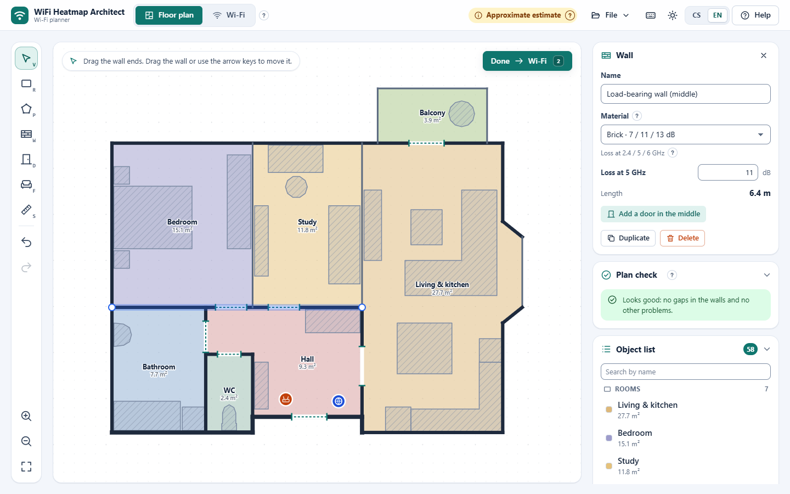
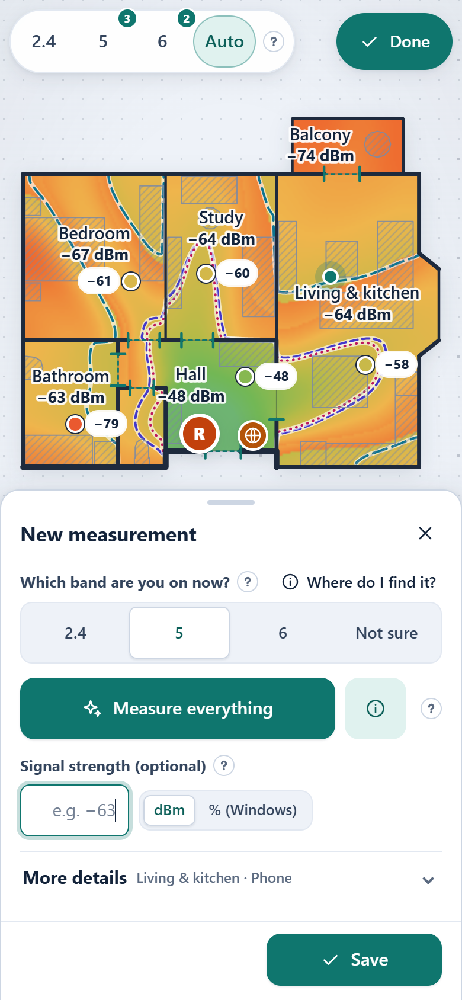
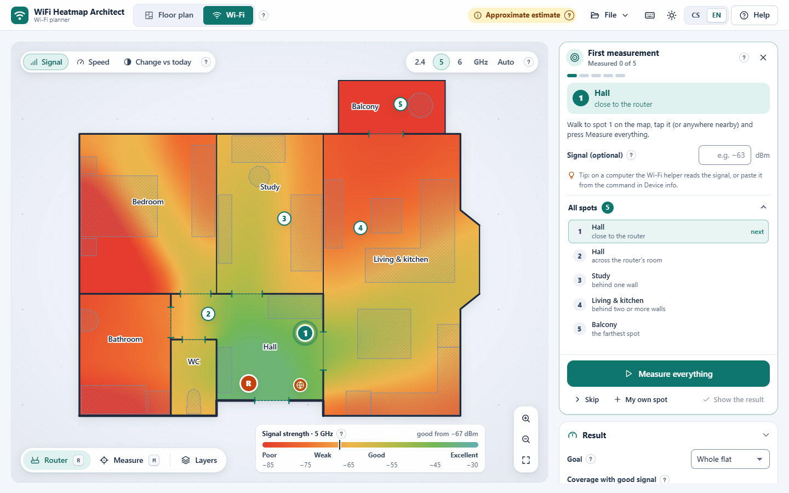
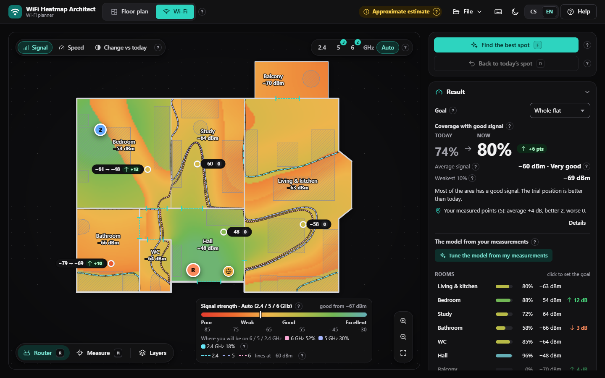

# WiFi Heatmap Architect

**Where is your Wi-Fi signal good, and where should the router go?** Draw your home (or start from the demo flat),
drag the router around and watch a live heat map of the signal. Built for ordinary people, not network engineers:
plain language, little "?" hints everywhere, Czech and English.

**Open the app: <https://zizlik.github.io/WiFi-Heatmap-Architect/>** (Czech version:
[index.cs.html](https://zizlik.github.io/WiFi-Heatmap-Architect/index.cs.html)). It works on a computer and on a phone,
can be installed to the home screen and keeps working offline.

[](https://github.com/Zizlik/WiFi-Heatmap-Architect/actions/workflows/ci.yml)
[](LICENSE)


<p>
  
  
</p>

## What it does

WiFi Heatmap Architect estimates Wi-Fi coverage from a floor plan. Every wall, door and larger piece of furniture takes
some signal away; the app turns that into a colour map of your home, a coverage percentage for the whole flat and for
every room, and a suggestion where the router would serve you best. A short guided "first measurement" at a few spots
tunes the model to your real home: how strong your router really is, how much your walls take away, and what internet
speed you get in every room.

It is a single self-contained HTML file: no account, no installation, no server. Calculations run in your browser.

## Features

- **Live heat map** of the signal for 2.4, 5 and 6 GHz, with plain-word quality (Excellent ... Unusable), coverage of
  the whole flat and per room, and a "change vs today" view that shows what moving the router would gain or lose.
  Walls and furniture weaken the bands differently (per-band material tables: brick 7 / 11 / 13 dB at 2.4 / 5 / 6 GHz),
  so 2.4 GHz reaches visibly further through walls and 6 GHz the least.
- **Auto band for Wi-Fi 6/7 routers** that switch bands by themselves (band steering, Wi-Fi 7 MLO): the *Auto* map
  shows at every spot the band a phone or laptop would most likely use there (6 GHz near the router, then 5, then 2.4);
  just tick which bands your router transmits and the app does the rest. You never have to pin a device to one band:
  every measurement records the band it was taken on (detected by the helper on a computer, chosen - or "I don't
  know" - on a phone), the model is tuned per band and the map switches to the band you measure on.
- **What would change at your measured spots**: move the router, add a wired access point, a mesh node or a repeater,
  and every measurement dot shows the predicted change ("−72 → −58 (+14)", "↓120 → ≈310 Mb/s"). A list sorts your spots
  by benefit with a one-line verdict ("the repeater helps mainly in the bedroom"). Speeds through a wireless node are
  capped by its link to the router (a repeater behind a wall rarely gives more than ~300 Mb/s) and by the device
  ceiling you enter, and the app says which limit applies. The prediction and the dots themselves are map layers
  (*Layers > Predicted change at points*, key `P`, and *Measurement points*) you can switch off for a clean map.
- **Find the best spot**: an optimiser scores router positions about half a metre apart all over the floor (or only in
  a room you choose), refines the best ones and moves the router there. One key (`D`) brings it back to where it stands today.
- **Floor-plan editor** with rectangle and polygon rooms, walls (with materials), doors, furniture presets, real-world
  scale, snapping, undo/redo, a tracing background (an image of your plan to draw over) and a **plan check** that finds
  gaps in walls, misplaced doors and overlapping rooms.
- **One click: "Measure everything"** (*Změřit vše*): tap where you stand and the app gathers what it can about this
  device, the Wi-Fi details (from the optional helper or a pasted command output), runs the speed test and saves the
  measurement - with a live checklist, *Cancel* at any time and *Undo* afterwards.
- **"First measurement" guide** (*Prvotní měření*): confirm where the router stands, and the app marks 4-6 spots on the
  map (next to the router, behind one wall, behind two, the farthest room). Measure each one and it tells you in plain
  words what it learned - "your router is 4 dB stronger than assumed", "your walls take about 25 % more", "the model
  now fits within ±2 dB (before ±5 dB)" - and the map follows. You can switch between the tuned and the default model
  or reset it.
- **Whole-home throughput** (*Propustnost bytu*): from your speed tests and the (tuned) signal map: how much of the
  home meets your speed target, the typical speed in every room, the weakest spot (one click shows it on the map) and
  whether your internet plan or the Wi-Fi is the limit.
- **Device info** (*Info o zařízení*): what the browser can tell about this device (system, browser, connection type)
  and, said plainly, what no browser can see (network name, signal in dBm, channel, link rate). For a computer it shows
  one ready command per system with a *Copy* button and a 3-step guide (Windows `netsh wlan show interfaces | clip`,
  macOS `system_profiler SPAirPortDataType | pbcopy`, Linux `nmcli ... | xclip`); paste the result and the app reads the
  network, band, channel, signal and link rate (Czech and English Windows output included). Phones: the free WiFiman app.
- **Measurements & calibration**: enter the signal you measured at a few spots (dBm, or % from Windows) and the model
  shifts to agree with them; it reports how well it fits and flags measurements that do not fit at all.
- **Built-in speed test** (download, upload, ping, jitter) against Cloudflare's speed-test servers, started only when
  you tap it. With speeds measured in places with clearly different signal the app can also draw a predicted
  **speed map**.
- **Second access point / mesh**: wired AP, wired or wireless mesh node, or a repeater, with backhaul quality.
- **Works offline and installs like an app** (PWA) when opened from the web page; the downloaded HTML file also
  works by double-click, with no network at all.
- **Czech and English**, switchable at any time; three looks - **Light**, **Deep dark** (neutral near-black) and
  **OLED black** (pure black, hairline borders) - or *Auto* following the system; colour-blind friendly palette.
- **Report a problem**: if something goes wrong, the error message has *Details* (what failed and where, copyable), and
  *Help > Report a problem* copies a diagnostic summary (app version, browser, the last errors) - without your floor
  plan, measurements, network names (SSID), BSSIDs or MAC addresses.
- **Keyboard first**: every action has a shortcut, every icon has a tooltip with its key, `?` shows them all.





### Keyboard shortcuts

| Where | Key | Action |
|---|---|---|
| Everywhere | `1` / `2` | Floor plan / Wi-Fi mode |
| | `?` / `F1` | Shortcut sheet / Help |
| | `Ctrl+S` / `Ctrl+O` | Save the project as SVG / open a file |
| | `Ctrl+Z` / `Ctrl+Shift+Z`, `Ctrl+Y` | Undo / redo |
| | `+` `-` `0` | Zoom in / out / show the whole plan |
| | `Esc` | Cancel, close |
| Wi-Fi mode | `R` / `M` | Router tool / measure tool |
| | `F` | Find the best spot |
| | `D` | Router back to today's spot |
| | `B` / `V` / `L` | Next band (2.4, 5, 6, Auto) / next view (signal, speed, change) / range lines |
| | `P` | Predicted change at the measured points on / off (map layer) |
| | arrows (`Shift`) | Move the router by 0.25 m (1 m) |
| | `Enter` | Save a pending measurement |
| Floor plan | `V` `R` `P` `W` `D` `F` `S` | Select, rectangle room, polygon room, wall, door, furniture, scale |
| | `G` / `T` | Snap to grid / tracing background |
| | `Enter` | Finish a polygon room |
| | `Delete` / `Ctrl+D` | Delete / duplicate the selection |
| | arrows (`Shift`) | Nudge the selection (4x) |

Mouse and touch: drag empty space to pan, wheel or two fingers to zoom, double-click empty space to fit the plan.

## On a phone

Open <https://zizlik.github.io/WiFi-Heatmap-Architect/> and add it to the home screen (Android: browser menu >
*Add to Home screen* / *Install app*; iPhone: Safari > Share > *Add to Home Screen*). After the first visit it works
offline; only the speed test needs a connection. Walk through your home, tap the map where you stand and run the speed
test: after a few spots you see where the internet is fast and where it is not. When a new version is published the
app offers it with a *Reload* button.

To move a project between devices save it as SVG (File > Save project as SVG) and open that file on the other device.

## Wi-Fi details on a computer: the helper (`pomocnik/`)

No browser lets a web page read the network name (SSID), the access point (BSSID), the signal in dBm, the channel or
the link rate - on any system, phones included - and a web page cannot start a program. On a computer the folder
[`pomocnik/`](pomocnik/) closes that gap: a small read-only script that **you start once by double-click**; while its
window is open, every *Measure everything* picks up the Wi-Fi details by itself. The app works fully without it.

| System | Start this (in `pomocnik/`) | Notes |
|---|---|---|
| Windows 10 / 11 | `Windows/Spustit pomocníka.cmd` (+ `wifi-helper.ps1` next to it) | SmartScreen: *More info* > *Run anyway*. Windows 11 24H2+ needs *Settings > Privacy & security > Location* on. |
| macOS | `macOS/Spustit pomocníka.command` (+ `wifi-helper.py`) | Gatekeeper: right-click > *Open* (macOS 15+: *System Settings > Privacy & Security > Open Anyway*). Needs Python 3. Use Chrome, Edge or Firefox. |
| Linux | `sh Linux/spustit-pomocnika.sh` (+ `wifi-helper.py`) | Needs `python3` and `nmcli` or `iw`. |

- Each OS folder also has a **one-shot** launcher (*Jednorázově zjistit Wi-Fi*) that copies the details to the
  clipboard and opens the app with them in the address (`#wifi=…`, read and removed by the app) - no window to keep open.
- The app links the files from *Device info* (*Download the helper for …*) and from Help; the whole folder is also in
  the repository download.
- Safe by design: listens on `127.0.0.1:47823` only, answers only this app's pages (CORS allow-list, Host check), GET
  only, a fixed command list, no installation, no administrator rights, nothing sent to the internet; the adapter's own
  MAC address is removed.
- **Permission prompt on the web version**: Chrome / Edge protect the local network, so the first time the page at
  zizlik.github.io talks to the helper they ask whether it may *access devices on your local network*. The app only asks
  when you press *Connect the helper* (or *Measure everything*), explains the prompt and waits for you: click *Allow*. If
  you clicked *Block*: lock icon next to the address > *Site settings* > *Local network access* > *Allow*, then reload. The
  double-clicked file (`file://`) needs no permission. Without the helper you can paste the command output instead, or
  pick the band yourself.
- Czech step-by-step guide: [pomocnik/CTI-ME.txt](pomocnik/CTI-ME.txt); details, API and security model:
  [pomocnik/README.md](pomocnik/README.md).

## Privacy

Calculations run in your browser. Your floor plan, measurements and settings are stored only in your browser's local
storage (or in the SVG files you save yourself) and are never uploaded. The network is used only to load and update
the app (from GitHub Pages) and for the **speed test you start yourself**, which downloads and uploads test data
to and from `speed.cloudflare.com` (about 30-60 MB per run; mind mobile data). The optional Wi-Fi helper runs on your
own computer: the app asks it (`http://127.0.0.1:47823`) only when you press *Measure everything* or open *Device info*,
and the details it returns stay in your browser like any other measurement. The app has no analytics and no cookies.

## Using your own floor plan

- **Draw it**: Floor plan mode (`1`) > rectangle (`R`) or polygon (`P`) rooms, then *Outline the rooms with walls*,
  add doors (`D`) and big furniture (`F`), and set the real width of the home or measure a known distance (`S`).
- **Trace an image**: drop a PNG, JPG or WebP (a photo of the plan, a real-estate drawing) onto the app; it becomes a
  tracing background and you draw the rooms over it.
- **Open a saved project**: an SVG saved from this app (File > Save project as SVG) contains the whole project and
  opens again with `Ctrl+O` or drag and drop. SVG files from other programs are used as a tracing background.

### File format compatibility

Projects are SVG drawings with the data in `<metadata id="wifi-plan-data">` using the `wifi-floor-v2` format of the
previous version of the app (rooms, walls, doors, furniture, background, width, router, original, optic). Version 3
reads those files unchanged and writes files that the old version can still open; its extra settings (scale, second
AP, measurements, view) are stored alongside under `project` and ignored by older versions.

## Development

No dependencies, no bundler. The sources in `src/` are plain browser scripts that `build.mjs` concatenates (in path
order) into two self-contained files, `index.cs.html` (Czech default) and `index.html` (English default); they are the
same app and switch language at runtime. The build also writes `sw.js` and `manifest.webmanifest` for the installable,
offline-capable web version (the service worker is only used over http/https, never for a double-clicked file).

```sh
node build.mjs            # build index.html, index.cs.html, sw.js, manifest.webmanifest
node build.mjs --check    # + checks: syntax, cs/en strings complete, hints, no external URLs, PWA files, size <= 2 MB
node tests/engine/run-all.mjs    # all unit tests (node:test): engine (geometry, propagation, calibration fit,
                                 # optimiser, formats ...), speed test, Wi-Fi details parser (tests/devinfo)
npm test / npm run check / npm run build    # the same through npm
WH_PRIVATE_PLAN=/path/to/plan.svg node tests/engine/run-all.mjs   # + extra checks on a real plan of your own (never committed)
```

- `src/js/00-core` runtime (i18n, store with undo, viewport) - `10-engine` the DOM-free model (runs in Node for the
  tests) - `20-ui` shell, widgets, hints, icons, PWA - `30-io` import/export - `35-speedtest` the speed test -
  `36-devinfo` the parser of Wi-Fi command output (pure, Node-tested) - `40-editor` floor-plan mode - `50-planner` Wi-Fi
  mode (incl. *Measure everything*, *Device info* and the *First measurement* guide) - `90-app` glue. `pomocnik/` holds
  the optional local Wi-Fi helper (PowerShell / Python, each file < 200 lines, see its README). `src/SPEC.md` and `src/DESIGN.md` describe the
  product and the UI contract, `src/ENGINE-API.md` the engine.
- The generated files are committed because GitHub Pages serves the repository as it is; CI fails when they are not
  rebuilt. Serve the folder over http to try the PWA locally, e.g. `python -m http.server`.
- README screenshots: `npm install --no-save puppeteer-core && node docs/make-screenshots.mjs` (uses the demo flat).
- The PWA icons in `assets/` are the brand mark rendered to PNG (192, 512, maskable 512, apple-touch 180).

## Credits

- Signal model: log-distance path loss with per-wall and per-object losses, in the spirit of the indoor propagation
  model of [ITU-R P.1238](https://www.itu.int/rec/R-REC-P.1238/en). It is an estimate, not a measurement - calibrate it
  with a few real readings.
- Speed test: the measuring method (latency samples, growing download/upload sizes, 90th-percentile throughput) is
  modelled on Cloudflare's open-source [speedtest](https://github.com/cloudflare/speedtest) client (MIT) and uses
  the public endpoints of [speed.cloudflare.com](https://speed.cloudflare.com/). Not affiliated with Cloudflare.
- Signal readings on phones: the free WiFiman app by Ubiquiti shows dBm values on Android and iPhone.

## License

[MIT](LICENSE) © 2026 Zizlik

---

## Česky

**Kde máš dobrý Wi-Fi signál a kam dát router?** Nakresli svůj byt (nebo začni ukázkovým), přetahuj router a sleduj
živou mapu signálu. Aplikace je pro běžné lidi, ne pro síťaře: srozumitelná čeština, malé otazníčky s vysvětlením
u všeho, co není na první pohled jasné.

**Otevři aplikaci: <https://zizlik.github.io/WiFi-Heatmap-Architect/index.cs.html>** (v češtině; adresa bez
`index.cs.html` se v českém prohlížeči otevře česky také). Funguje na počítači i v telefonu, dá se přidat na plochu
a funguje i bez internetu.

### Co umí

- **Mapa signálu** pro pásma 2,4, 5 a 6 GHz, pokrytí celého bytu i jednotlivých místností a pohled „Změna proti dnešku“.
  Zdi a nábytek tlumí každé pásmo jinak (cihla 7 / 11 / 13 dB při 2,4 / 5 / 6 GHz), takže 2,4 GHz projde zdmi nejdál.
- **Pásmo Auto pro routery Wi-Fi 6/7**, které přepínají pásma samy (band steering, Wi-Fi 7 MLO): mapa Auto ukáže
  v každém místě pásmo, které by tam telefon nebo notebook nejspíš použil (u routeru 6 GHz, dál 5, nejdál 2,4). Telefon
  ani počítač nemusíš držet na jednom pásmu: každé měření si zapíše pásmo, na kterém vzniklo (na počítači ho zjistí
  pomocník, na telefonu ho vybereš, nebo zvolíš „Nevím“), model se ladí pro každé pásmo zvlášť a mapa se přepne na
  pásmo, na kterém měříš.
- **Co by se změnilo v tvých bodech**: přesuň router, přidej přístupový bod po kabelu, mesh nebo opakovač a u každého
  měření uvidíš odhad změny („−72 → −58 (+14)“, „↓120 → ≈310 Mb/s“). Seznam seřadí body podle přínosu a jednou větou
  shrne výsledek („Opakovač pomůže hlavně v ložnici“). Rychlost přes bezdrátový uzel omezí jeho spojení s routerem
  (opakovač za zdí dá málokdy víc než ~300 Mb/s) a strop zařízení, který zadáš; aplikace řekne, co tě zrovna brzdí.
  Předpověď i samotné body jsou vrstvy mapy (*Vrstvy > Předpověď u bodů*, klávesa `P`, a *Body měření*), dají se vypnout.
- **Najít nejlepší místo** pro router (kdekoli, nebo jen ve vybrané místnosti); klávesa `D` ho vrátí na dnešní místo.
- **Kreslení půdorysu**: místnosti, zdi s materiálem, dveře, nábytek, měřítko, obkreslení obrázku a **kontrola
  půdorysu**, která najde díry ve zdech a další chyby.
- **Změřit vše jedním klepnutím**: klepni do mapy, kde stojíš, a aplikace sama zjistí, co jde (zařízení, údaje
  o Wi-Fi z pomocníka nebo z vloženého výpisu), změří rychlost a měření uloží. Průběh vidíš v seznamu kroků, zrušit
  jde kdykoli a uložení vrátíš tlačítkem Zpět.
- **Prvotní měření** (průvodce): potvrdíš, kde router stojí, a aplikace ti na mapě ukáže 4-6 míst (u routeru, za
  jednou zdí, za dvěma, nejvzdálenější místnost). Na každém zmáčkneš Změřit vše a aplikace lidsky řekne, co zjistila -
  „tvůj router je o 4 dB silnější“, „zdi u tebe tlumí asi o 25 % víc“, „model teď sedí na ±2 dB (dřív ±5 dB)“ -
  a mapu podle toho upraví. Kdykoli můžeš přepnout na výchozí model nebo ho vrátit.
- **Propustnost bytu**: z testů rychlosti a (doladěné) mapy signálu - na kolika procentech bytu splníš cílovou
  rychlost, typická rychlost v každé místnosti, nejslabší místo (ukáže ho na mapě) a jestli tě brzdí tarif, nebo Wi-Fi.
- **Info o zařízení**: co prohlížeč o zařízení ví (systém, prohlížeč, připojení) a na rovinu i to, co nezjistí žádný
  prohlížeč (název sítě, signál v dBm, kanál, rychlost linky). Na počítači nabídne jeden příkaz pro tvůj systém
  s tlačítkem Kopírovat a návodem ve 3 krocích; výsledek vložíš a aplikace z něj vyčte síť, pásmo, kanál, signál
  i rychlost linky (umí český i anglický výpis Windows). Na telefonu poradí aplikaci WiFiman.
- **Měření a kalibrace**: zadáš signál naměřený telefonem a model se podle něj doladí; měření, která vůbec nesedí,
  aplikace označí.
- **Vestavěný test rychlosti** (stahování, odesílání, odezva) přes servery Cloudflare; spustí se jen, když na něj
  klepneš. Z měření na více místech pak aplikace nakreslí i odhad rychlosti.
- **Druhý přístupový bod / mesh / opakovač**.
- **Funguje offline a jde nainstalovat** jako aplikace; stažený HTML soubor funguje i po dvojkliku bez internetu.
- Čeština i angličtina, tři vzhledy - **Světlý**, **Deep dark** (neutrální téměř černá) a **OLED černá** (čistá černá
  s jemnými linkami) - nebo Automaticky podle systému; klávesové zkratky (tabulka výše, `?` v aplikaci ukáže všechny).
- **Nahlásit problém**: když se něco pokazí, u chybové hlášky jsou Podrobnosti (co a kde selhalo, jdou zkopírovat)
  a Nápověda > Nahlásit problém zkopíruje diagnostiku (verze, prohlížeč, poslední chyby) - bez půdorysu, měření,
  názvů sítí (SSID), BSSID a MAC adres.

### Na telefonu

Otevři <https://zizlik.github.io/WiFi-Heatmap-Architect/> a přidej si ji na plochu (Android: menu prohlížeče >
*Přidat na plochu*; iPhone: Safari > Sdílet > *Přidat na plochu*). Pak projdi byt, klepni do mapy tam, kde stojíš,
a spusť test rychlosti. Projekt z počítače přeneseš jako soubor SVG (Soubor > Uložit projekt jako SVG).

### Pomocník pro Wi-Fi na počítači (složka `pomocnik/`)

Žádný prohlížeč nesmí webové stránce prozradit název Wi-Fi, sílu signálu, kanál ani rychlost linky a stránka sama
nespustí žádný program. Na počítači to vyřeší složka [`pomocnik/`](pomocnik/): malý skript, který jen čte údaje o Wi-Fi
a který **jednou spustíš dvojklikem** (Windows: `Spustit pomocníka.cmd`, macOS: `Spustit pomocníka.command`, Linux:
`sh spustit-pomocnika.sh`). Dokud jeho okno běží, Změřit vše si údaje vezme samo. Poslouchá jen na tomto počítači
(`127.0.0.1:47823`), odpovídá jen stránce aplikace a nic neposílá na internet. U aplikace z internetu se Chrome nebo Edge
napoprvé zeptají, jestli stránka smí „přistupovat k zařízením v místní síti“. Aplikace se ptá jen po kliknutí na
Připojit pomocníka (nebo Změřit vše), dotaz vysvětlí a počká: klikni na Povolit. Pokud jsi omylem zablokoval: ikona zámku
vedle adresy > Nastavení webu > Přístup k místní síti > Povolit a obnov stránku. Soubor otevřený dvojklikem žádné
povolení nepotřebuje. Podrobný návod: [pomocnik/CTI-ME.txt](pomocnik/CTI-ME.txt). Aplikace funguje i bez pomocníka
(výpis příkazu vložíš ručně, nebo pásmo vybereš sám).

### Soukromí

Výpočty běží v prohlížeči. Půdorys, měření ani nastavení se nikam neodesílají, ukládají se jen do úložiště tvého
prohlížeče (nebo do SVG, které si sám uložíš). Síť se použije jen k načtení a aktualizaci aplikace a při **testu
rychlosti, který spustíš sám** (stahuje a odesílá testovací data přes `speed.cloudflare.com`, asi 30-60 MB; pozor na
mobilní data). Volitelného pomocníka na vlastním počítači se aplikace ptá (`http://127.0.0.1:47823`) jen při Změřit vše
nebo v Info o zařízení. Žádná analytika, žádné cookies.

### Vlastní půdorys

Nakresli ho v režimu Půdorys (`1`), nebo do aplikace přetáhni obrázek plánu (PNG, JPG, WebP) a obkresli ho. Uložený
projekt (SVG z této aplikace) otevřeš přes `Ctrl+O` nebo přetažením. Soubory starší verze (`wifi-floor-v2`) se načtou
beze změny a nová verze ukládá tak, aby je otevřela i ta stará.

### Pro vývojáře

`node build.mjs` sestaví `index.cs.html`, `index.html`, `sw.js` a `manifest.webmanifest` ze složky `src/`,
`node build.mjs --check` vše zkontroluje a `node tests/engine/run-all.mjs` spustí testy. Žádné závislosti.

Licence [MIT](LICENSE) © 2026 Zizlik. Model šíření signálu vychází z ITU-R P.1238, metoda testu rychlosti z open-source
měřáku Cloudflare.
